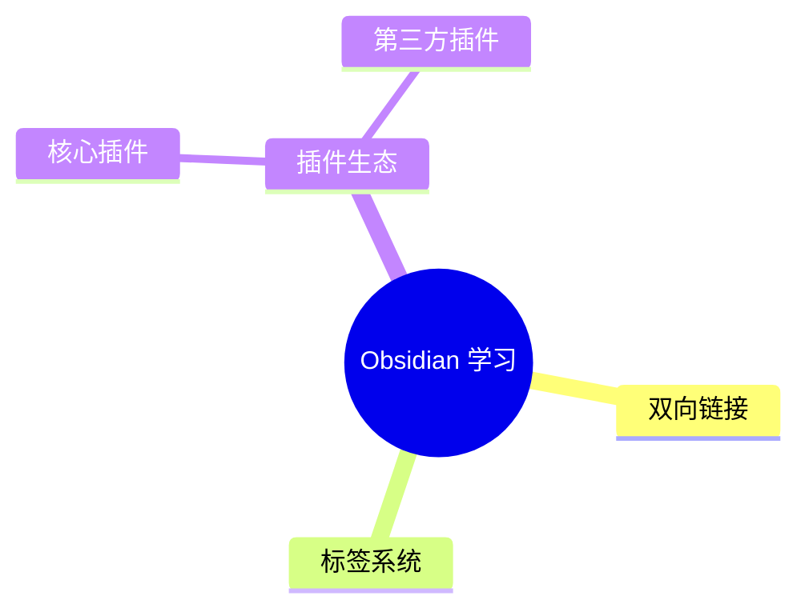
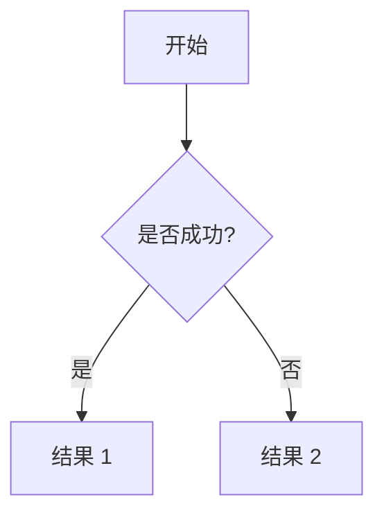
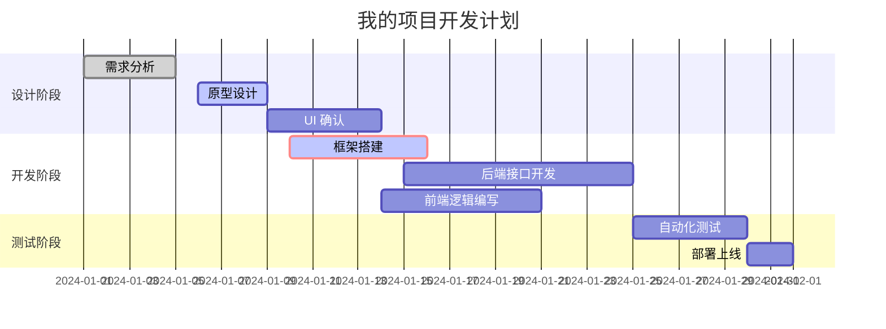
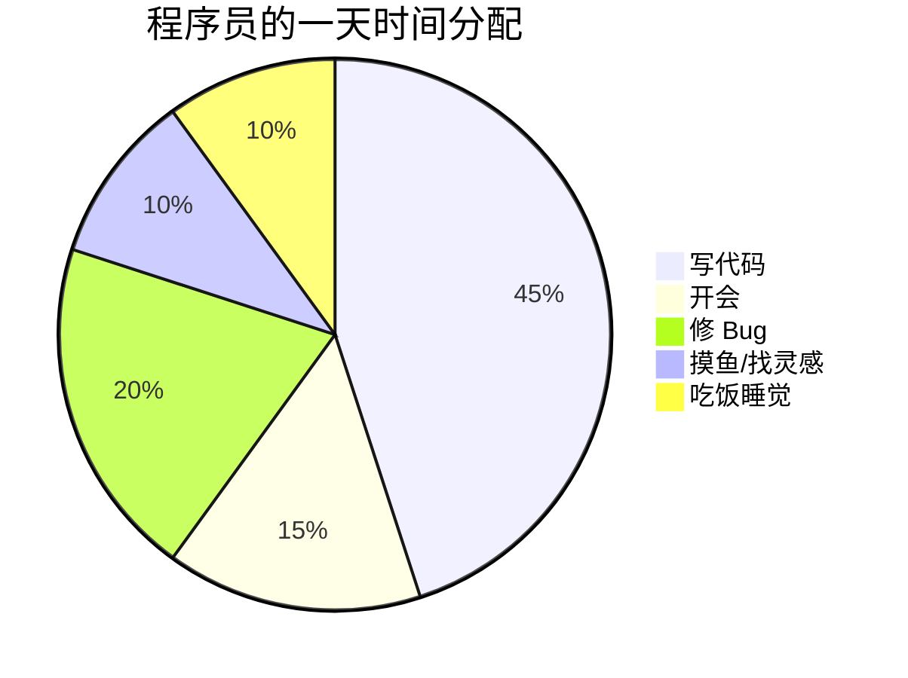

如你所见，这个页面并没有任何用处，只是用来测试 github markdown 预览的兼容性

## Webp 动画预览


## 图
### 思维导图

### 流程图



### 甘特图



### 饼图



## Latex 公式
$$\mathcal{L}_{SM} = \underbrace{ -\frac{1}{4} F_{\mu\nu} F^{\mu\nu} }_{\text{Gauge terms}} + \underbrace{ i \bar{\psi} \cancel{D} \psi }_{\text{Matter terms}} + \underbrace{ (D_\mu \phi)^\dagger (D^\mu \phi) - V(\phi) }_{\text{Higgs terms}} + \underbrace{ \bar{\psi}_i Y_{ij} \psi_j \phi + \text{h.c.} }_{\text{Yukawa coupling}}$$


$$
\mathbf{A}=
\begin{bmatrix}
\dfrac{\partial^2 f}{\partial x^2} & \dfrac{\partial^2 f}{\partial x\,\partial y}\\
\dfrac{\partial^2 f}{\partial y\,\partial x} & \dfrac{\partial^2 f}{\partial y^2}
\end{bmatrix}
\implies
\det(\mathbf{A}-\lambda\mathbf{I})
= \lambda^2-(\mathrm{tr}\,\mathbf{A})\lambda+\det(\mathbf{A}),
\qquad
\int_{-\infty}^{\infty} e^{-\beta x^2}\,dx=\sqrt{\frac{\pi}{\beta}}\;(\beta>0).
$$

已知勾股定理的表达式为 $a^2 + b^2 = c^2$，而欧拉公式则是被誉为数学中最美的公式： $e^{i\pi} + 1 = 0$

## 警告与提示框 (Alerts)

> [!NOTE]
> 这是一个普通说明。

> [!TIP]
> 这是一个好用的小技巧。

> [!IMPORTANT]
> 这是一个关键信息。

> [!WARNING]
> 这是一个警告，请务必注意。

> [!CAUTION]
> 危险！请谨慎操作。

## 任务列表 (Task Lists)
- [x] 已完成的任务
- [ ] 正在进行的任务
- [ ] 计划中的任务

## 代码高亮
```python
import math

def calculate_circle_area(radius):
    """计算圆的面积"""
    if radius < 0:
        return "半径不能为负数"
    
    area = math.pi * (radius ** 2)
    return f"半径为 {radius} 的圆面积是: {area:.2f}"

# 测试函数
r = 5
print(calculate_circle_area(r))

# 列表推导式示例
numbers = [1, 2, 3, 4, 5]
squares = [n**2 for n in numbers if n % 2 == 0]
print(f"偶数的平方: {squares}")
```

## 内容折叠
<details>
<summary>点击展开查看详细配置</summary>

这里可以放很长很长的代码或文字。

</details>

## 特殊文件预览（GitHub 独有）

GitHub 会对某些特定格式的文件进行**自动图形化渲染**：

- **STL / 3D 文件**：如果你上传了 `.stl` 文件，GitHub 会提供一个 3D 浏览器界面。
    
- **GeoJSON / TopoJSON**：自动渲染成交互式地图。
    
- **CSV 数据**：直接以整齐的表格形式展示数据，而不是纯文本。

## 表情包 (Emojis)
直接输入 `:emoji_name:` 即可

:rocket:
