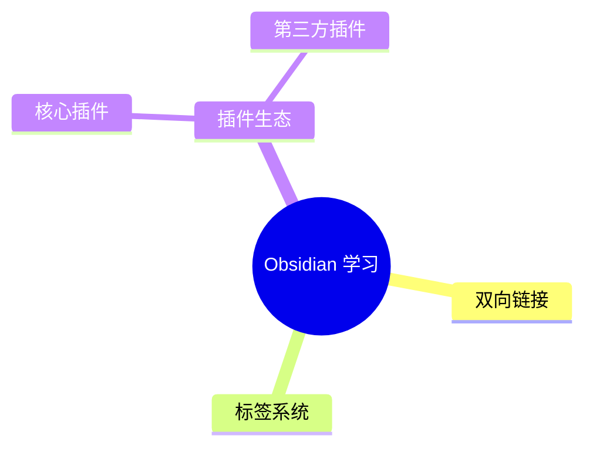

如你所见，这个页面并没有任何用处，只是用来测试 github markdown 预览的兼容性

## Webp 动画预览

## 思维导图

## Latex 公式
$$\mathcal{L}_{SM} = \underbrace{ -\frac{1}{4} F_{\mu\nu} F^{\mu\nu} }_{\text{Gauge terms}} + \underbrace{ i \bar{\psi} \cancel{D} \psi }_{\text{Matter terms}} + \underbrace{ (D_\mu \phi)^\dagger (D^\mu \phi) - V(\phi) }_{\text{Higgs terms}} + \underbrace{ \bar{\psi}_i Y_{ij} \psi_j \phi + \text{h.c.} }_{\text{Yukawa coupling}}$$

$$\mathbf{A} = \begin{pmatrix} \frac{\partial^2 f}{\partial x^2} & \frac{\partial^2 f}{\partial x \partial y} \\ \frac{\partial^2 f}{\partial y \partial x} & \frac{\partial^2 f}{\partial y^2} \end{pmatrix} \implies \det(\mathbf{A} - \lambda \mathbf{I}) = \sum_{k=0}^{n} \alpha_k \lambda^k = \int_{-\infty}^{\infty} e^{-\beta x^2} dx$$

